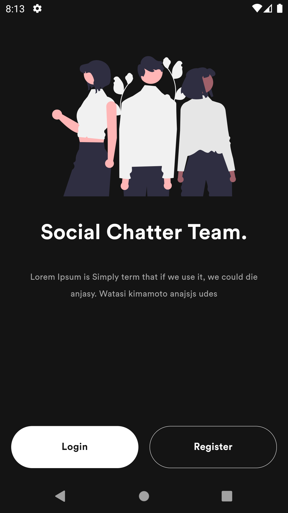
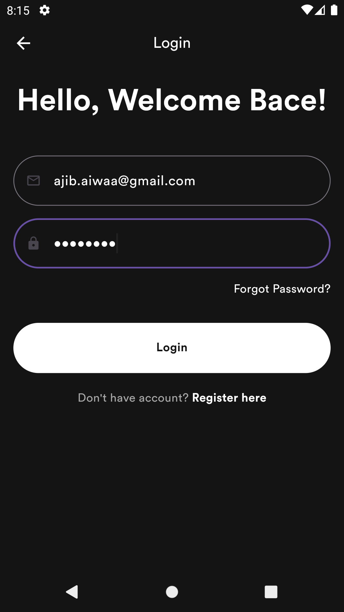
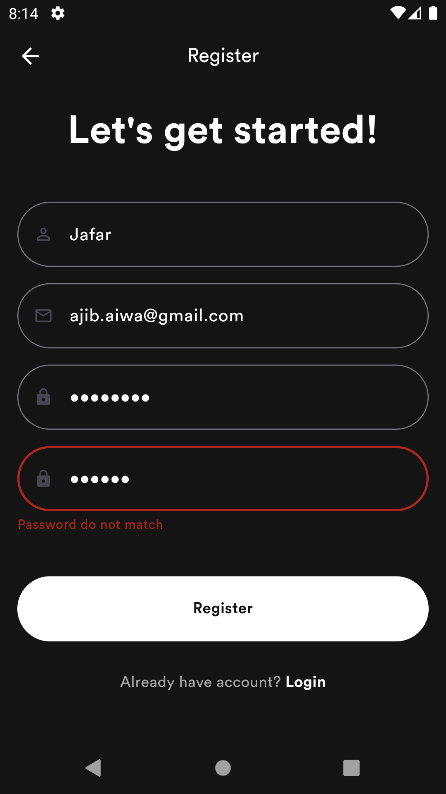
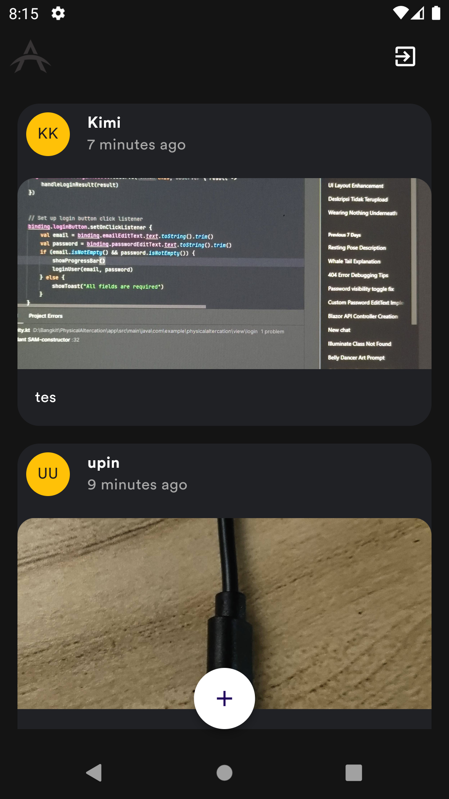
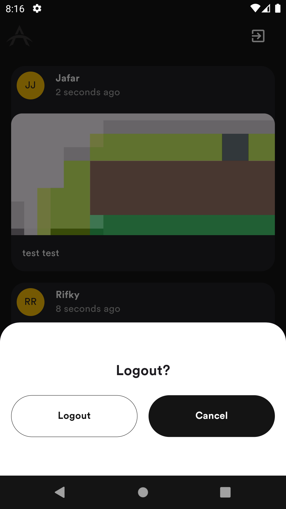

[![Contributors][contributors-shield]][contributors-url]
[![LinkedIn][linkedin-shield]][linkedin-url]

<!-- PROJECT LOGO -->
 

  

  <h3 align="center">Ash Story</h3>

  

    Social Media App
     
  

<!-- TABLE OF CONTENTS -->

  
Table of Contents

  <ol>
    <li>
      <a href="#about-the-project">About The Project</a>
      <ul>
        <li><a href="#built-with">Built With</a></li>
      </ul>
    </li>
    <li><a href="#contributing">Contributing</a></li>
    <li><a href="#contact">Contact</a></li>
  </ol>

<!-- ABOUT THE PROJECT -->
## About The Project

Ash Story is a mobile social media application where users can view photos shared by other users. The app provides a simple and engaging platform for exploring and interacting with visual content. It was created as a submission project for the Flutter Intermediate course on Dicoding.
 
This project focuses on implementing modern Flutter practices and follows clean architecture principles. It includes robust state management, efficient API communication, and seamless navigation.

**Key Features:**

- User Authentication: Login functionality for secure access, using Dio for API requests and shared_preferences for token management.
- Photo Feed: Users can browse a dynamic feed of photos uploaded by others.
- Navigation: Go_Router ensures smooth and efficient navigation between app screens.
- State Management: Bloc Cubit provides a reactive approach to manage states effectively.
- Focus Detector: Ensures optimized performance and user experience.

**Screenshots App:**

  
| Welcome Screen | Login Screen | Register Screen |
|:--------------:|:------------:|:---------------:|
|  |  |  |

| Home Screen | Add Story Screen | Logout Screen |
|:-----------:|:----------------:|:-------------:|
|  |  |  |

### Built With

**Framework:**
* [![Flutter][Flutter]][Flutter-url]

**Library and Technology:**
* [![Dio][Dio]][Dio-url]
* [![Bloc-Cubit][Bloc]][Bloc-url]
* [![Go-Router][Go-Router]][Go-Router-url]

<!-- CONRTIBUTORS -->
### Contributors:

<!-- 
(<a href="#readme-top">back to top</a>)
 -->

<!-- CONTACT -->
## Contact

Ja'far - ajib.aiwa@gmail.com

<!-- MARKDOWN LINKS & IMAGES -->
<!-- https://www.markdownguide.org/basic-syntax/#reference-style-links -->
[contributors-shield]: https://img.shields.io/github/contributors/jafar144/AshStory.svg?style=for-the-badge
[contributors-url]: https://github.com/othneildrew/Best-README-Template/graphs/contributors
[linkedin-shield]: https://img.shields.io/badge/-LinkedIn-black.svg?style=for-the-badge&logo=linkedin&colorB=555
[linkedin-url]: https://www.linkedin.com/in/jafarrmu/
[product-screenshot]: images/screenshot.png
[Flutter]: https://img.shields.io/badge/Flutter-20232A?style=for-the-badge&logo=flutter&logoColor=61DAFB
[Flutter-url]: https://flutter.dev/
[Dio]: https://img.shields.io/badge/Dio-20232A?style=for-the-badge&logo=dio&logoColor=61DAFB
[Dio-url]: https://pub.dev/packages/dio
[Bloc]: https://img.shields.io/badge/Bloc--Cubit-20232A?style=for-the-badge&logo=bloc&logoColor=61DAFB
[Bloc-url]: https://pub.dev/packages/bloc
[Go-Router]: https://img.shields.io/badge/Go--Router-20232A?style=for-the-badge&logo=bloc&logoColor=61DAFB
[Go-Router-url]: https://pub.dev/packages/go_router
